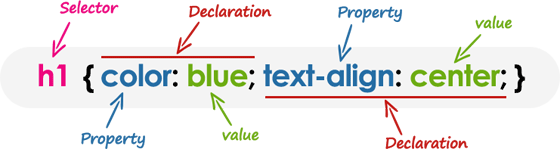

<p align="center">
    
</p>

CSS3 Fundamentals
=====================
CSS is a stylesheet language that allows you to control the appearance of your webpages. In this hands-on course will demonstrate the concepts that form the foundation of CSS, Creating a CSS file, Writing basic CSS selectors, Setting CSS properties and explains how to use this stylesheet language to add colors and other design elements to take your webpages beyond standard black & white text/background. Will learn guidelines for page layouts with floats, Setting a font family, font size, text color, how the box model defines the spacing and sizing of page elements, styling text, and managing basic layouts. Will also explores the tools needed to work with CSS, how to use selectors to target elements and more.

### Prerequisites for current course / What you need to know
To move forward with CSS you must need basic knowledge of XHTML/HTML. Its an added advantage if you know basic concepts like Web, Internet, Web Page, URL, images, Web Design with XHTML/HTML etc. Its advisable to view [Web Design Development Foundations-Web Technology Fundamentals](https://github.com/dinanathsj29/web-design-development-fundamentals) and [HTML5 Essentials](https://github.com/dinanathsj29/html5-essentials) before jumping into CSS3 Fundamentals.

Topics include
=====================
1. [Course Introduction](#section-1-course-introduction)
2. [Introducing CSS](#section-2-introducing-css)
3. [CSS Basics](#section-3-css-basics)
4. [CSS Specifications](#section-4-css-specifications)
5. [Common CSS Concepts](#section-5-common-css-concepts)
6. [CSS Resources](#section-6-css-resources)
7. [Whats Next Step?](#section-7-whats-next-step)

Section 1. Course Introduction
=====================
### 1.1. Welcome
Hi All, I'm **`Dinanath Jayaswal, Senior UI/Web Developer and Adobe Certified Expert Professional`**, I wanna welcome you to CSS3 Fundamentals. This course is designed to introduce you to the basic CSS concepts, terminology, and tools. Its perfect of any new web designer/developer looking for a good starting point with CSS. Will start by exploring the basics of CSS, what CSS is?, syntax, how CSS works, use CSS to create websites, using CSS on a wide variety of platforms. I will start by giving an overview of CSS, CSS features, browser support, followed by formatting text, layouts, images, box model, positioning, CSS online tools, and resources.

Section 2. Introducing CSS
=====================
### 2.1. Importance
#### 3 pillars / core Languages/technologies used for Frond End Web Design/Development
1. HTML (HyperText Markup Language) - Markup language, Essential Page Structure/Content, Redable and convey structure to user, Text Layout Model, page Mark-up, Text, Tags, Data, details for pages, Images, Tables, Anchor Links, Forms`**
2. **`CSS (Cascading Style Sheet) - Style Sheet language, Page Design / Presentation / Layouts / Styling / Formattings, look and feel, Creative part of Web Pages`**
3. **JavaScript (JS)** - Scripting language, Dynamic Page Behaviour, Logics, Conditions and Validations, Events, Interactivity with User, Dynamic updates in a Web Page


> **Syntax & Example**:
```html
<!DOCTYPE html>
<html lang="en">

  <head>

    <meta charset="UTF-8">
    <meta name="viewport" content="width=device-width, initial-scale=1.0">
    <meta http-equiv="X-UA-Compatible" content="ie=edge">
    <title>02.01.css.intro.html</title>

    <!-- internal style -->
    <style>

      /* css selector: { property:value; } */
      body{
        background-color: #FFC0E5;
        font-family: Arial, Helvetica, sans-serif;
        line-height: 30px;
      }
    </style>
    
  </head>

  <body>

    <h1>02.01.css.intro.html</h1>

    <!-- inline style -->
    <h1 style="font-family:Impact, Haettenschweiler, 'Arial Narrow Bold', sans-serif; text-decoration: underline;"></h1>>Getting Started with CSS</h1>

    <p>In this tutorial you'll learn how easy it is to add style and formatting information to the web pages using CSS. But, before we begin, make sure that you have some working knowledge of HTML. <br /> <br />
    If you're just starting out in the world of web development, start learning from here <br /><br />
    Well, let's get started with the most popular style sheet language.</p>

  </body>

</html>
```

### 2.2. What is CSS?
- CSS stands for `Cascading Style Sheets`
- CSS is `presentational, styling, formatting language` developed to `control look and feel` of HTML documents 
- CSS is the Stylesheet language/technology developed to create Page Designs / Layouts / Styling / Formattings, look and feel of web pages
- CSS is the `key presentational technology` that is used in website design
- Cascading refers to the way that CSS apply one style on top of another
- HTML controls the structure of web page, `CSS controls the presentation/styles/design`
- Stylesheets are a collection of formatting/styling/presentation rules

> **Example**: HTML is like a new Raw concrete Building structure, CSS is like skin (outside of the building looks)

### 2.3. Why use CSS? (Benefits of CSS)
- Separate styles/presentation rules from content (separation of concern)
- CSS provides better & high-end controls over the look and feel
- With CSS Designer/Developers gain lots of flexibility & consistency over styling
- Highly modularise web design with external independent .css files
- CSS is significant as it applies one style to many elements/tags
- Apply one style to many styles
- Apply a set of styles to many documents of an application
- Target different media like Screen, Print, Mobile device

### 2.4 Advantages of CSS
One of the biggest advantages of using CSS is that it allows the separation of style and layout from the content of the document. Let us have a look at some more advantages of using CSS:
- Easy Maintenance (separate .css file)
- CSS Save Lots of Time (re-usability)
- Pages Load Faster (separation of concern)
- Superior Styles to HTML (Provide more attributes) 
- Multiple Device Compatibility
- Global web standards

### 2.5. Prerequisites of using CSS (Cascading Style Sheets)
#### Tools for building web sites-web pages/writing HTML & CSS

1. **Text Editor/HTML Editor** - `NotePad, NotePad++, SublimeText, Atom, Brackets, Coda, Visual Studio Code, DreamWeaver` etc.
	- A CSS file (.css) is a text file itself consists of CSS style & properties, so to create/modify a CSS file we can use any text editors.
2. **Browsers To view output of .html pages with .CSS styles** - `Google Chrome, Mozilla Firefox, Internet Explorer, Safari` etc.
	- Once the .html/.htm file created and saved, we can create a .CSS file and link within HTML and then we can see its output in any latest web browser.
	
<p>
  <figure>
    &nbsp;&nbsp;&nbsp; 
    <figcaption>&nbsp;&nbsp;&nbsp; Image - Widely used modern browsers</figcaption>
  </figure>
</p>

Section 3. CSS Basics
=====================
### 3.1. Default Browser styles
- Open any HTML page (Unstyled / No CSS used) in browser, have a look on content styles
> **Note**: Saying Unstyled is not accurate as every browser apply own default style set to visual CSS rules `user agent stylesheet` on every elements like `<h1> to <h6>, <ul> <ol> <li>, <p>, <a> [fonts used, different size of text, space between paragraphs, anchor links color]`.
- When Designer/Developer writes CSS to show custom look it overwrites browser default styles and apply `custom styles`
- Many HTML elements come with browser specific some default CSS properties which can sometimes result in unknown/unwanted behaviour
- For example `Input boxes`, `selec option dropdown` are displayed differently in different browsers
> **Note**: Check the page source or Inspect page with Debugger utilities like: `FireBug, Inspect/ Inspect Element` (in browser -> Right Click on page -> choose Inspect Element -> Check/observe actual HTML/CSS code/tags/properties).

> **Note**: `CSS Reset` a collection of styles allows designers to avoid conflicts between their styles and browser default styles.

> **Syntax & Example**: 
```html
<body>

    <h1>03.01.default.browser.styles.html</h1>

    <ul>
      <li><strong>**Note**: Check the page source or Inspect page with Debugger utilities like: `FireBug, Inspect/ Inspect Element` (in browser -> Right Click on page -> choose Inspect Element -> Check/observe actual HTML/CSS code/tags/properties).</strong></li>
    </ul>

    <p>When Designer/Developer writes CSS to show custom look it overwrites browser default styles and apply `custom styles` <br /> <br />
    - Many HTML elements come with browser specific some default CSS properties which can sometimes result in unknown/unwanted behaviour</p>

  </body>
```

### 3.2. CSS syntax
- Learning CSS / CSS Syntax is remarkably very simple and easy
- A CSS rule consists of a set of styles/rules that are interpreted by the browser and then applied to the corresponding elements in the document



> **Syntax**: 
```css
selector { 
    property: value;    /* declaration/rule 1 */
    property: value;    /* declaration/rule 2 */
}
```

> **Example**: 
```html
<head>

    <!-- internal style -->
    <style>

      /* css selector: { property:value; } */
      body{
        background-color: #FFC0E5;
        font-family: Arial, Helvetica, sans-serif;
        line-height: 30px;
      }

      p { 
        color: #0000ff; 
        font-size: 20px;
      } 
    </style>
    
  </head>

  <body>

    <h1>03.02.syntax.html</h1>

    <ul>
      <li>A CSS rule consists of a set of style rules that are interpreted by the browser and then applied to the corresponding elements in the document.</li>
    </ul>

    

    <p>Selectors are used to declare which of the markup elements a style applies to. <br /> <br />
    The declarations that appear in the block that follows the selector may be applied to all elements of a specific type or only those elements that match a certain attribute.
    </p>
    
  </body>
```

#### Basic elements of CSS syntax:
- A CSS style rule is made of following parts:

| **Item**          | **Description**                                       |
| ----------------- |-------------------------------------------------|
| selector          | Target (it may be an HTML Element/Tag/Id/Class)           |
| declaration/rule  | Definition part in curley brace { property: value; }  |
| property          | skin/style attribute to change (font, size, color, border) 			    |
| value             | value to apply to CSS properties (Arial font, 10px size, red color) |

> **Note**: Writing `selector` is just half part of CSS rule, rest half belongs to `property: value` want to set.

### 3.3. Basic Selector types
- Selector helps to `target` an `elements` on the page 
- The selector allows us to tell the browser which element/tag on the page we want to style
- CSS selectors are used to `target/find/select` HTML elements based on `element/tag name, id, class, attribute, and more`
- Selector may target: Single element, group of elements, .class, #id, any specific conditional element
- Selectors are used to declaring which of the markup elements a style applies to, Selector indicates the HTML element you want to style

### 3.4. Element/Tag/Type Selector
- The element selector target/find/selects the `HTML element/tag by name`
- Global selectors based on any HTML element/tag name
- This is the simplest/basic way to `target all elements` of a given element/tag/type

> **Syntax**: 
```css
Element/Tag { 
    property: value;    /* declaration/rule 1 */
}
```

> **Example**: 
```html
<!-- internal style -->
<style>

    /* css selector: { property:value; } */
    h1 { 
        background-color: #9999ff; 
        text-transform: uppercase;
    } 

    li {
        line-height: 30px;
        letter-spacing: 3px;
    }

    p {
        border: 2px dashed #9999ff;
    }

</style>
```

### 3.5. Class Selector
- The class selector selects HTML elements with a `specific class attribute` 
- It is used with a period character `. (full stop symbol)` followed by the class name
- Attribute selector based on `class attributes` applied to HTML element/tag
- A generic set of rules applied to similar looking item (belongs to same .class)
- `.class` is a very important attribute while dealing with HTML+CSS as similar looking/output based things on a web page usually belongs to one class
- `.class` selector is a more precise way to target an element/markup as compared to ab `element/tag/type` selector

> **Note**: `.class` and `#id` attributes/selectors not only allows to style content but primarily exists to give more meaning/semantics to content.

> **Syntax**: 
```css
.className { 
    property: value;    /* declaration/rule 1 */
}
```

```html
<h1 class="className">Some heading content </h1>
```

> **Example**: 
```css
.headingsLarge { 
    border: 2px dotted red;
    text-transform: uppercase;
    text-decoration: underline;
    padding: 10px;
}
```

```html
<h1 class="headingsLarge">Some heading content </h1>
  
```

### 3.6. Id Selector
- The id selector `selects the id attribute` of an HTML element to select a specific element 
- It is used with a `hash/pound character # sign` followed by the id name
- Attribute selector based on specific id attributes applied to HTML element/tag
- An `id` is always `single/unique` within the page so it is chosen to select a single, unique element in a web page
- #id is very important attribute while dealing with HTML+CSS to make and `target single unique thing` in document

> **Note**: `#id` and `.class` attributes/selectors not only allows to style content but primarily exists to give more meaning/semantics to content.

> **Syntax**: 
```html
<h1 id="idName">Some heading content </h1>
```

```css
#idName { 
    property: value;    /* declaration/rule 1 */
}
```

> **Example**: 
```html
<h1 id="headingMain">Some heading content </h1>
```

```css
.headingMain { 
    border: 2px dotted red;
    text-transform: uppercase;
    text-decoration: underline;
    padding: 10px;
    
    font-family:Arial;
    font-style: italic;
    letter-spacing: 6px;
    text-align: center;
}   
```

### 3.7. Universal Selector
- The universal selector `selects all the elements` on the page
- Rather selecting elements of a specific type, the universal selector simply `matches the name of any element type`
- The universal selector is used as a `wildcard * character`

> **Syntax**: 
```css
* { 
    property: value;    /* declaration/rule 1 */
}
```

> **Example**: 
```css
* { 
    color: purple;
    letter-spacing: 4px;
    line-height:36px;
}   
```

### 3.8. Group/Grouping Selector
- Group/Grouping selector allows you to `group different types of selectors together` that share similar formatting
- Grouping selector is used to `minimize the code`, its highly efficient selector
- It also prevents you from repeating the same style rules over and over again
- You can apply a style to many selectors, Just `separate the selectors with a comma (,)`
- `Commas ,` are used to separate each selector in grouping

> **Syntax**: 
```css
element,.class,#id, element selector{ 
    property: value;    /* declaration/rule 1 */
}
```

> **Example**: 
```css
/*
.headingsLarge { 
    color: purple;
    letter-spacing: 3px;
    line-height: 36px;
    word-spacing: 5px;
    text-transform: capitalize;
}

#headingMain{
    color: purple;
    letter-spacing: 3px;
    line-height: 36px;
    word-spacing: 5px;
    text-transform: capitalize;
}
*/

.headingsLarge, #headingMain, p, .highlightRed, li { 
    color: purple;
    letter-spacing: 3px;
    line-height: 36px;
    word-spacing: 5px;
    text-transform: capitalize;
}  
```

### 3.9. Conditional/Descendent Selector (parent-child)
- `Highly specific selector` that target elements based on their location within other elements
- You can use this selector when you need to select an element that is the `descendant/inside of another element`
- You want to apply a style rule to a particular element only when it lies inside a particular element
- `White space` is used to denote a hierarchy of element (parent nested child)
- Conditional/Descendent selector is used to `minimize the code`, its highly efficient selector

> **Syntax**: 
```css
parent child selector{ 
    property: value;    /* declaration/rule 1 */
}
```

> **Example**: 
```css
div p { 
    color: blueviolet;
    border: 2px dashed gold;
    padding: 20px;
    margin: 50px;
} 

ol .highlightRed{ 
    color: purple;
    letter-spacing: 3px;
    line-height: 36px;
    word-spacing: 5px;
    text-transform: capitalize;
    font-family: arial;
    background-color:#66a7a7;
}
```

### 3.10. Pseudo-class Selector 
We used many selectors like `element, class, id, universal` etc. these are fully dependent on DOM structural representation (Document Object Model). But special states like `:hover, :active, :visited, :before :after` are styled with Pseudo-class Selector.
- pseudo means `not actually but having the appearance of; pretended; false or spurious;`
- Pseudo-class selectors are CSS selectors with a colon preceding them `:`
- A CSS pseudo-class is a keyword added to a selector that specifies a `special state` of the selected element(s) like `hover, active, focus, visited, link`
- Pseudo-classes let you apply a style to an element not only in relation to the content of the document tree
- a pseudo-class is basically a special state or specific characteristic of an element that can be targeted with CSS. A few common pseudo-classes are `:link, :visited, :hover, :active`

> **Syntax**: 
```css
element:link {
    property: value;    /* declaration/rule 1 */
}

element:visited {
    property: value;    /* declaration/rule 1 */
}

element:hover {
    property: value;    /* declaration/rule 1 */
}

element:active {
    property: value;    /* declaration/rule 1 */
}
```

> **Example**: 
```html
<head>
<!-- internal style -->
<style>
    
    /* css selector: { property:value; } */
    body {
        background-color: #67b1b1;
        font-family: Arial, "Helvetica Neue", Helvetica, sans-serif;
    }

    .links-container a {
        width: 10%;
        background-color:#999;
        padding: 5px;
        margin: 10px;
    }

    .horizontal-menu a {
        display: inline-block;
    }

    .vertical-menu a {
        display: block;
    }

    .links-container a:link {
        color: #000;
    }

    .links-container a:visited {
        color: #666;
    }

    .links-container a:hover {
        color: #fff;
        font-weight: bold;
        background-color: #008080;
        border-bottom: 2px solid;
    }

    .links-container a:active {
        color: #008080;
        background-color: #fff;
    }

    .link-active {
        text-decoration: none;
        color: #008080 !important;
        font-weight: bold;
        border-bottom: 5px solid;
        background-color: #fff !important;;
    }

</style>
```

```html
<body>
    
    <div class="links-container horizontal-menu">
      <a class="link-active" href="#">Home</a> 
      <a href="#">About</a>
      <a href="#">Products</a>
      <a href="#">Services</a>
      <a href="#">Contact</a>
    </div>

    <br /> <br />
    <div class="links-container vertical-menu">
      <a class="link-active" href="#">Home</a> 
      <a href="#">About</a>
      <a href="#">Products</a>
      <a href="#">Services</a>
      <a href="#">Contact</a>
    </div>
      
</body>
```

### 3.11. Authoring options / Where and How to add CSS
CSS is linked/added to HTML pages to format the document according to information in the style sheet. Styles can be added/written/located/inserted in 3 different ways (at 3 different places one can write css):

1. **External stylesheet** (Separation of concern) *[Using the `<link> element`, pointing to an external CSS file]*
2. **Internal stylesheet** (Embedded stylesheet) *[Using the `<style> element` in the head section of a document]*
3. **Inline stylesheet** *[Using the `style attribute` in any HTML start tag]*

#### 1. External stylesheet (Separation of concern)
- We can put required CSS styles into one `separate .CSS` file
- External stylesheet is like a normal text file with `.CSS extension` containing styles for HTML markup
- Most of the time we have to use an external style sheet (.css file) to separate Markup, Style, and Script from a web document 
- `<link />` tag is used under `<head>` section to embed/import/link external CSS file which can be used in various HTML pages
- An advantage of external CSS file over internal(embedded)/inline CSS is that a `single CSS file can be used in multiple pages` of an application to get flexibility & consistency over styling (efficient)
- An external style sheet `holds all the style rules` in a separate document that you can link from an HTML file on your site.
- External style sheets are the `most flexible` because, with an external style sheet, you can change the look of an entire website by changing just one file.

> **Syntax & Example (.html document file)**:
```html
<head>

    <link rel="stylesheet" type="text/css" href="../assets/styles/03.11.1.style.css" />

</head>
```

> **Syntax & Example (.css stylesheet file)**:
```css
/* external css file - css selector: { property:value; } */
body{
  background-color: #d3d3ff;
  font-family: Arial, Helvetica, sans-serif;
  line-height: 30px;
}

h1 {
  font-family: Impact, Haettenschweiler, 'Arial Narrow Bold', sans-serif;
  text-decoration: underline;
  text-transform: uppercase;
  letter-spacing: 5px;
}
```

#### 2. Internal stylesheet (Embedded stylesheet)
- Internal (Embedded) CSS is used to apply CSS on a single/specific document or page
- An Internal style sheet may be useful if one single page has a unique style
- An Internal/Embedded style sheets only affect the document they are embedded in
- `<style>` tag is used to write internal styles under `<head>` section (binds to current file only)
`<style>` tag allows us to write directly into the document
- Used in small non-scalable apps (it isn't quite efficient as external stylesheets)

> **Syntax & Example**:
```html
<head>
    <!-- internal style -->
    <style>
        /* css selector: { property:value; } */
        body{
            background-color: #d3d3ff;
            font-family: Arial, Helvetica, sans-serif;
            line-height: 30px;
        }

        h1 {
            font-family: Impact, Haettenschweiler, 'Arial Narrow Bold', sans-serif;
            text-decoration: underline;
            text-transform: uppercase;
            letter-spacing: 5px;
        }
    </style>
</head>
```

#### 3. Inline stylesheet
- We can write/apply style directly into an HTML element
- Inline CSS is used to apply CSS on a single line or element 
- `style` attribute is used to write inline styles specific to an element `<p style="color:blue;">Some Text</p>`
- Please don't use this, unless you really have to! It is really a `bad practice and bad for maintenance` (you might have to update the same information multiple times per document)
- Used in small non-scalable apps (kind of last moment patch/solution)

> **Syntax & Example**:
```html
<!-- inline style -->
<body style=" background-color: #d3d3ff;
            font-family: Arial, Helvetica, sans-serif;
            line-height: 30px;">

    <!-- inline style -->
    <h1 style="font-family: Impact, Haettenschweiler, 'Arial Narrow Bold', sans-serif;
            text-decoration: underline;
            text-transform: uppercase;
            letter-spacing: 5px;">Syntax: Welcome to HTML</h1>
</body>
```

#### CSS authoring points/understandings:
- Most of the projects rely heavily on external stylesheets
- Internal (Embedded) styles are mainly used to overwrite external styles
- Inline styles are like last moment fix/patch/solution to achieve the required style output
- One should plan an overall site strategy for style placement

### 3.12. How Browsers apply styles
#### 3.12.1 Selector reading mechanism
- Browser reads selectors from `Right to Left`
- > **Note**: .content p span { color: blue; } 
    - First, the browser will select all **`span`**
    - Secondly, it will scan for **`p`**
    - After filtering all results it will check that **`p`** and **`span`** are present inside **`.content`** class or not
> Its advisable to find out and write an efficient, simplified version of a selector

#### 3.12.2. The Cascade mechanism
- CSS is an abbreviation for Cascading Style Sheets, which indicates that the notion of the cascade is important while working with styles
- If multiple CSS rules will have selectors matching the same element in such cases, which CSS rule "wins", and finally applied to the element? This is controlled by a mechanism called the Cascade; 

#### 3.12.3. CSS apply order
1. External stylesheet (Separation of concern)
2. Internal stylesheet (Embedded stylesheet)
3. Inline stylesheet
> **Note**: If any styles conflicts with each other than `latest/most recent and closest/nearest` set of styles overwrites the earlier style
> **Note**: Cascade simply means `last rule applied wins!`

#### 3.12.4. The cascade dependency factors
What selectors win out in the cascade depends on three factors (listed in order of weight — earlier ones will overrule later ones):
1. Importance / !important 
2. Specificity
3. Inheritance (Source order)

#### 1. Importance / !important
- `!important` - One property/keyword to rule all!
- In CSS, there is a special piece of syntax you can use to make sure that a certain declaration will always win over all others: `!important`
- The `!important` rule is used for overriding the previously assigned CSS declarations OR to make the current rule as a supreme rule
- It is strongly recommended that you `never use !important` unless you absolutely have to

> **Syntax & **Example**:
```css
.paraText {
  background-color: gray;
  border: none !important;
}

p {
  background-color: blue;
  color: white;
  padding: 5px;
  border: 2px dashed black;
}
```

```html
<body>
    <p class="paraText" id="mainPara">One selector to rule them all!</p>
</body>
```

#### 2. Specificity
- Specificity is basically a measure of how specific a selector/rule is
- If more conflicting CSS rules comes to the same element, than the browser follows some rules to determine which one is a most specific selector to apply and wins out
- **`ID selectors` have an even higher specificity than `class selectors` and lowest is `element selectors`**
> **Note**: The only way to win against an ID selector is to use `!important` or using `inline styles`. The only way to win against an `!important` is to include another !important declaration

#### Specificity points Chart/Table (ICE)

| Selector              |  Points           |&nbsp; |&nbsp;     |&nbsp;     |&nbsp;             |            
| --------------------- |:------------------:|:-----:|:---------:|:---------:|-----------------:|
|                       | style attribute   | ID    | Classes   | Element   | Specificity Score |
| body (Element/Tag)    | 0                 | 0     | 0         | 1         | 0001              |
| .class (.content)     | 0                 | 0     | 1         | 0         | 0010              |
| #id (#mainContent)    | 0                 | 1     | 0         | 0         | 0100              |
| **No selector, but style attribute** | 1      | 0     | 0         | 0         | **1000**              |
| div p                 | 0                 | 0     | 0         | 2         | 0002              |
| #mainContent p        | 0                 | 1     | 0         | 1         | 0101              |
| .content p            | 0                 | 0     | 1         | 1         | 0011              |
| #mainContent .content p   | 0             | 1     | 1         | 1         | 0111              |

> **Note**: Selector/Rule with more score/points finally wins

> **Syntax & Example**:
```html
<!-- internal style -->
<style>
    /* css selector: { property:value; } */

    /* element - least specific - specificity point/score= 1 */
    p{
        background-color: gray;
        color: #fff;
        padding: 5px;
    }

    /* class - little specific - specificity point/score= 10 */
    .paraText {
        color: #000;
    }

    /* id - more specific - specificity point/score= 100 */
    #mainParaText {
        color:#00f;
    }

    /* element + id - much more specific - specificity point/score= 101 */
    p#mainParaText {
        color:#0f0;
    } 

    /* !important - the supereme rule*/
    p {
        color:#f00 !important;
    } 
</style>


<body>
    <p class="paraText" id="mainParaText" style="color:gold;">What selectors win out in the cascade depends on three factors (listed in order of weight — earlier ones will overrule later ones):</p>
</body>
```

#### 3. Inheritance (Source order)
- Inheritance simply means using some properties from parent/container elements to a child
- The inherit keyword specifies that a property should inherit its value from its parent element
- Latest/last rules applied will win over earlier rules
- Styles are cumulative; so the final rendering of elements depends not only on selectors directly target the element but also any properties that might be inherited from parent/top-level elements
- **Note**: All child elements in documents inherits properties from CSS rules applied to body/parent/container elements

> **Syntax & Example**:
```html
<!-- internal style -->
<style>
    /* css selector: { property:value; } */

    body {
        font-family: verdana;
        color: #2617da;
        margin: 10px;
        padding: 10px;
        font-style: italic;
    }

    p {
        background-color: gray;
        color: #fff;
        padding: 5px;
    }

    h1 {
        color: #b50e0e;
    }

</style>
```

### 3.13. How CSS works with HTML structure
CSS works with the structure of the HTML document along the browser parse the html code, find the right element and style accordingly.
> **Load HTML -> Parse HTML -> Load CSS -> Parse CSS -> Browser creates DOM Tree with (parsed HTML + CSS)  -> Display into Browser**

**Guidelines for writing HTML**:
- Focus on writing clean, Semantic, consistent and efficient HTML markup/code
- Its impossible to write an efficient CSS Without a logical, consistent HTML structure
- Structure the HTML so that it adds meaning to the content
- Don't focus on styling when initially structuring HTML markup/code

**Best Practices to write HTML & CSS**:
- **HTML**
    - Use consistent HTML structure through-out web page/app
    - Organize code with comments
    - Refactor code as and when necessary
    - Separate content from style
    - Use the Alternative Text & Title Attribute on Images
    - Make Use of Semantic Elements
    - Avoid non-semantic markup

- **CSS**
    - Use meaningful classes and Id's (descriptive names with a role like - content, sidebar, authors, quotes)
    - Modularize Styles for Reuse
    - Write CSS Using Multiple Lines & Spaces
    - Use Proper Class Names
    - Build Proficient Selectors (Avoid long selectors)
    - Use Shorthand Properties & Values
    - Use Shorthand Hexadecimal Color Values
    - Group & Align Vendor Prefixes

### 3.14. Browser rendering differences
- Browsers developed independently of each other, so different browsers rendering engines parse, renders and displays output differently
- Each browser has its own different parsers, policies, preferences on how to render and display content
> **Note**: `Hack` code designed to overcome an error/Browser rendering differences of a specific browser

#### Common Rendering Engines

| Engine        | Browser       |
| ------------- |-------------|
| Trident       | Internet Explorer, (AOL - America Online), Windows Mobile |
| Presto        | Opera |
| Gecko         | Mozilla FF, Camino  |
| Webkit        | Safari, Google Chrome |

#### W3C and Web standards (World Wide Web Consortium)
- `W3C (World Wide Web Consortium) is main International Standards Organization for the World Wide Web help in `developing protocols and guidelines` that ensure long-term growth for the Web
- W3C (World Wide Web Consortium) started in the year 1994 to issue recommendations for web technologies
- Check web standards for consistent design (The Web Standard Project): www.webstandards.org
- W3C website: https://www.w3.org/

### 3.15. CSS Comments
- Comments are useful for organizing styles, annotating code, or communicating code scenarios with team members
- CSS comments are generally `written to explain your code`
- Comments are also great for debugging, understanding code logic, purpose etc. because you can comment out lines of code
- It is very helpful for the users who read your code so that they can easily `understand the code`
- Comments are `ignored by browsers`, it is `good for developers`
- Single or multiple lines comment is written as: `/* code */`

> **Syntax & Example**:
```html
<!-- internal style -->
<style>
    /* css selector: { property:value; } */

    /* reset default styles */
    /* body, h1 {
        margin:0px;
        padding:0px;
    } */
</style>    
```

Section 4. CSS Specifications
=====================
CSS is constantly changing and evolving, new features and capabilities are added to enhance design/styling. 
Initially/Originally HTML elements and attributes used to define basic styles like **bold**, *italics*, size, text color, background color etc.  

### 4.1. History of CSS
| Year          | History                                               |
| ------------- |-----------------------------------------------------|
| 1996          | CSS 1.0 released                                      |
| 1998          | CSS 2.0 released                                      |

> **Note**: 
- Early browser versions focused on market shares rather than compliance & standards
- Initially, due to no Web Standards, many browser companies had proprietary features, standards, and elements

| 2004          | 2.1 recommendations                                   |
| ------------- |-----------------------------------------------------|
| 2005          | 2.1 version moved to working draft by W3C (Due to non-implementation of a feature from browsers)           |
| 2007          | CSS 2.1 Candidate recommendation                      | 
| 2011          | CSS 2.1 Fully recommended                             | 

> **Note**: 
- CSS3 is not a single specification
- CSS/CSS3 now published as a series of modularised specifications
- Different features/utilities released separately like selectors, borders, box shadow, text-shadow, animations, transitions, media query etc.

### 4.2. The Current State of CSS
CSS is changing in nature, so significant changes keep on happening in the specification. 

- [CSS current work](https://www.w3.org/Style/CSS/current-work.en.html)
- [CSS current state](https://www.w3.org/standards/techs/css#w3c_all)
- [All CSS specifications](https://www.w3.org/Style/CSS/specs.en.html)

### 4.3. Checking browser support:
- CSS is constantly changing and evolving language, many features are implemented and many more are implementing. As a Web Designer/Developer you must know which features works and supports in a browser and which are not
- There are many rendering inconsistencies from browser to browser to due to frequent version changes or CSS specifications updations

> Online resources to check browser support:
- https://caniuse.com (Support tables for HTML5, CSS3, etc)
- https://quirksmode.org (Compatibility overview - maintained by Peter-Paul Koch)
- https://en.wikipedia.org/wiki/Comparison_of_browser_engines_(CSS_support)
- https://www.w3schools.com/cssref/css3_browsersupport.asp
- http://www.positioniseverything.net/ (Modern browser bugs explained in detail!)
- Browser development companies proprietary websites

Section 5. Common CSS Concepts
=====================
There are many CSS concepts and properties we use in day to day CSS work, lets dive into some of the common concepts used while working with CSS.

### 5.1. Working with fonts
- Controlling `typography-text-font` is one of the most important things to do with CSS
- CSS `Font` property is used to control the look of font-texts 
- By the use of CSS font property, you can change the font type, font-text size, color, style, bold etc.
- **Font styles**: Properties that affect the font that is applied to the text, affecting what font is applied, how big it is, whether it is bold, italic, etc.
> **Example/font attributes-properties**: font-family, font-size, color, font-style, font-weight, font-variant. https://www.fontsquirrel.com/   

#### CSS Font Choices
1. System Fonts
2. Web Fonts

1. **System Fonts**:
    - Older / Widely supported basic fonts
    - Limited numbers of fonts to use/apply
    - Only installed fonts on user/client machine to used/viewed
    - **Example**: (4 main category of fonts families)
        - **generic fonts family:** Serif, Sans-Serif, MonoSpace, Cursive**
        - **font family**: Times, Arial, Courier, Comic Sans
    - **Requesting fonts in fallback manner (Font stacks)**: `selector { font-family: Arial, Helvetica, Verdana, Sans-serif; }` (if requested font not available use default `serif` fonts)
2. **Web Fonts**:
    - Emerging technique
    - Lack of support in older browsers
    - Web Fonts refer to the technique of having the browser download and install fonts that are requested in the pages's styles using the `@font-face` syntax/method
    - https://fonts.adobe.com/  https://fonts.google.com/

> **Syntax & Example**:
```html
<!-- internal style -->
<style>
    /* css selector: { property:value; } */
    .headingText, h2, h3 {
        font-family: Arial, Helvetica, sans-serif;
        font-size: 3em; /* base font size * 3 = (16 * 3) = 48*/
        font-style: italic;
        font-variant: small-caps;
        font-weight: lighter;
        color:#008080;
        
        -webkit-font-smoothing: antialiased;
        -moz-font-smoothing: antialiased;
        -o-font-smoothing: antialiased;
        -ms-font-smoothing: antialiased;
        /* font-smoothing: antialiased; */
    }
</style>
```

### 5.2. Formatting text
- CSS text properties allow you to define several text styles such as color, alignment, spacing, decoration, transformation etc. very easily an effectively
- **Text layout styles**: Properties that affect the spacing and other layout features of the text, allowing manipulation of the space between lines and letters, and how the text is aligned within the content box
> **Example**: color, text-align, text-decoration, text-transform, line-height, direction, word-spacing, text-shadow

> **Syntax & Example**:
```html
<!-- internal style -->
<style>
    /* css selector: { property:value; } */
    .headingText, h2 {
        text-align: center;
        text-decoration: overline;
        text-transform: uppercase;
        color:#008080;
    }

    .normalList {
        letter-spacing: 4px;
        word-spacing: 8px;
        line-height: 30px;
        color: #008080;
    }
</style>
```

### 5.3. Color
- Colors are a pretty powerful way to express different feelings and emotions in our human life and play an important role while designing UI or UX
- Typically, `color` is used to set a color either for the foreground of an element (i.e., its text), for the background of the element,  or else affect the color of borders/decorative effects
- The CSS `color` property defines the foreground color (text color), `background-color` property defines the background color of an element
> **Example**: color, border-color, background-color

**One can specify color values in various formats, Following table lists all the possible formats**:
| Format	        |        Syntax	        |    Example
| ----------------- |---------------------|-----------------------------|
| Hex Code	        | #RRGGBB	            | h1 { color:#FF0000; }         |
| Short Hex Code	| #RGB	                | h1 { color:#F00; }            |
| RGB %	            | rgb(red%,green%,blue%)   | h1 { color:rgb(50%,50%,50%); }|    
| RGB Absolute	    | rgb(red,green,blue)	    | h1 { color:rgb(0,0,255); }    |
| RGBA	            | rgb(red,green,blue, alpha)| h1 { color:rgb(0,0,255,0.5); }    |
| HSL	            | hsl(hue, saturation, lightness)| h1 { color: hsl(140, 50%, 60%); }    |
| HSLA	            | hsl(hue, saturation, lightness, alpha)| h1 { color: hsl(140, 50%, 60%, 0.5); }    |
| Keyword/color name| red, black, etc.	    | h1 { color:teal; }            |

> **Note:**
> - RGB stands for Red Green Blue (3 main colors of web/screen) 
>    - defines the intensity of the color between 0 and 255.
> - HSL stands for Hue Saturation Lightness
>   - ***Hue*** is a degree on the color wheel from 0 to 360. 0 is red, 120 is green, and 240 is blue
>   - ***Saturation*** is a percentage value, 0% means a shade of gray, and 100% is the full color.
>   - ***Lightness*** is also a percentage, 0% is black, 50% is neither light or dark, 100% is white
> - 150+ color keywords/color names are supported by CSS

> **Syntax & Example**:
```html
<!-- internal style -->
<style>
    /* css selector: { property:value; } */
    .headingText, h2 {
        text-align: center;
        text-decoration: overline;
        text-transform: uppercase;
        color: hsl(140, 50%, 60%); /* Hue=140 -> green color, Saturation=50% -> 50% green not full green, lightness=60% -> lighter shade of green*/
    }

    h2 {
        color:rgba(0,155,0,0.5);
    }

    .normalList {
        letter-spacing: 4px;
        word-spacing: 8px;
        line-height: 30px;
        background-color: wheat;
        color:#000;
        border-bottom: 5px solid #2f4f4f;
        padding-bottom: 20px;
    }
</style>
```

### 5.4. Common Measurement units
- Units are used to specify non-zero length value in CSS properties
- Length measured can be either `absolute units such as pixels, points` and so on, or `relative such as percentages (%) and em` units
- CSS properties take "length" values, such as width, height, margin, padding, font-size, border-width etc.

**There are two unit types:** 
1. Absolute Values/Units
2. Relative Values/Units

1. **Absolute Values/Units**
    - Absolute values are also referred to as fixed values specify an exact measurement values
    - Typically used when physical properties of user agents are known
    - The absolute length units will appear as exactly as size mentioned
    - Absolute physical units such as `in, cm, mm`, etc. should be used for `print media and similar high-resolution devices`. 
    - An on-screen display such as `desktop and lower-resolution devices`, it is recommended to use the `pixel or em` units.
    - **Example**: in (inches), cm (centimeters), mm (millimeters), pt (points), pc (picas), * px (pixel units)
    > **Note**: * px (Pixels Units) are relative to the viewing device. 
    
2. **Relative Values/Units**
    - Relative Values/Units are relative to the units of parent/container or other elements
    - **Example**: %, em, rem, vw (viewport width), vh (viewport height)

| Unit	  | Description	                                            | Example                                                 |
|:-------:|-------------------------------------------------------|-------------------------------------------------------|
| %       | Relative to the parent/container element	            | p { font-size: 200%; }                                  |
| em      | Relative to the current font-size (a base font size), (1em = base size of the current font)                       | p { font-size: 2em; }  | 
| rem     | Relative to the font-size of the root element	        | p { font-size: 2rem }                                   |
| vw      | Relative to 1% of the width of viewport*	            | div { width: 100vw }                                    |
| vh      | Relative to 1% of the height of viewport*	            | div { height: 100vh }                                   |

> **Note**: * Viewport = the browser window size

> **Syntax & Example**:
```html
 <!-- internal style -->
<style>
    /* css selector: { property:value; } */
        body {
        font-size: 20px;
        margin: 0px;
        padding: 0px;
    }

    h1 {
        margin: 0px;
        padding: 0px;
    }

    .normalList {
        font-size: 0.5em;
        line-height: 3em;
        border:0.2em dashed #666;
        padding: 3em;
        margin: 2em;
    }

    .container {
        background-color: darkseagreen;
        height: 100vh;
        width: 100vw;
        display: table-cell;
        vertical-align: middle;
    }

    .sub-container {
        background-color:burlywood;
        padding:20px;
        width: 50vw;
        margin: 0 auto;
    }
</style>


<body>
    
    <div class="container">

      <div class="sub-container">

        <h1 class="headingText" id="mainHeadingText">5. Common CSS Concepts</h1>

        <p class="paraText" id="mainParaText">There are many CSS concepts and properties we use in day to day CSS work, lets dive into some of the common concepts used while working with CSS. </p>

        <h2>05.4. Common Measurement units</h2>

        <ul class="normalList">
          <li>Units are used to specify non-zero length value in CSS properties</li>
          <li>Length measured can be either `absolute units such as pixels, points` and so on, or `relative such as percentages (%) and em` units</li>
          <li>CSS properties take "length" values, such as width, height, margin, padding, font-size, border-width etc.</li>
        </ul>

        <h3>**There are two unit types:** </h3>

        <ol>
          <li>Absolute Values/Units</li>
          <li>Relative Values/Units</li>
        </ol>

      </div>

    </div>
    
</body>
```

### 5.5. Backgrounds
- CSS background properties are used to define background styles/effects for the elements

### Background Properties
The CSS provides several properties for styling the background of an element, like: 
1. **background-color**
    - The `background-color` property is used to set the `background color` of an element
2. **background-image**
    - The `background-image` property `set an image as a background` of an HTML element
3. **background-repeat**
    - By default, the `background-image` property `repeats an image` both horizontally and vertically
    - By using `background-repeat` property one can control how a background image is tiled in the background of an HTML element
    - Properties like `repeat-x & repeat-y` are used to repeat images horizontally (x-axis) or  vertically (y-axis) respectively
4. **background-attachment**
    - The `background-attachment` property determines whether the background image is `fixed with regard to the viewport or scrolls` along with the containing block
    - Sets whether a background image is fixed or scrolls with the rest of the page
    - The background-attachment property is used to control the scrolling of an image in the background
5. **background-position**
    - The `background-position` property is used to control the position of the background image
    - The background-position property is used to define the initial position of the background image. By default, the background image is placed on the top-left of the webpage.
    - Sets the starting position of a background image

> **Syntax & Example**: 
```css
<!-- internal style -->
<style>
    /* css selector: { property:value; } */
    ol li {
        height: 100px;
        font-weight: bold;
        margin-top: 20px;
        padding: 5px;
        border: 2px solid brown;
    }

    ol li:nth-child(1) {
        background-color: thistle;
    }

    ol li:nth-child(2) {
        background-image: url("../assets/images/css3.png");
        background-color: bisque;
    }

    ol li:nth-child(3) {
        background-image: url("../assets/images/css3.png");
        background-repeat: no-repeat; 
        background-color: darkseagreen;
    }

        /* body {
        background-image: url("../assets/images/css3.png");
        background-attachment: fixed;
    } */

    ol li:nth-child(5) {
        background-image: url("../assets/images/css3.png");
        background-repeat: no-repeat;
        background-color: wheat;
        background-position: center -50px; /* horizontal X and vertical Y position*/
    }

    ol li:nth-child(6) {
        background-image: url("../assets/images/css3.png");
        background-repeat: no-repeat;
        background-color: wheat;
        background-position: center center; /* horizontal X and vertical Y position*/
        background-size: contain;
    }
</style>


<ol>
    <li>**background-color**</li>
    <li>**background-image**</li>
    <li>**background-repeat**</li>
    <li>**background-attachment** <br />  uncomment and check body styles</li>
    <li>**background-position**</li>
    <li>**background-position**</li>
</ol>
```

### 5.6. Box Model
- The Box Model refers to the physical properties of an element rectangular box
- Every element displayed is comprised of one or more rectangular boxes. CSS box model typically describes how these rectangular boxes are laid out on a web page
- The Box Model concepts help to make layout/designing task easier
- **Box Model consists of properties like**: Margins, Borders, Padding and content width, height (these properties make physical dimension of an element)
    - Margin = Space outside/around an element
    - Border = Rectangular outline/border surrouding an element/box
    - Padding = Breathing space inside an element border
> Total width of an element: left border + left padding + content width + right padding + right border

The following diagram demonstrates how the margin, padding, and border CSS properties determine how much space an element can take on a web page:
<p align="center">
    
</p>

> **Syntax & Example**:
```css
.container {
    background-color: burlywood;
    width: 80%;
    padding: 20px;
    border:5px solid #c5760f;
    margin: 20px auto;
}
```

```html
<body>
    
    <div class="container"> 

    </div>

</body>
```

### 5.7. Margin 
- The margin is `Space outside/around an element`, Margin represents the `space between elements`
- Margin values are not calculated as part of an elements total width
- The margins do `not have a background-color`, it is `completely transparent`
- `Margin is outside` and Padding is inside
- Margin can be defined either to Top, Right, Bottom, Left or to each side of an element

> **Syntax & Example**:
```css
element {
    margin: margin-width/value;
}


div {
    margin: 10px 20px 30px 40px; /* Top, Right, Bottom, Left */
    margin-left: 50px; /* all sides equally */
}

--------------------

.normalList li:nth-child(odd) {
    /* margin: 10px 20px 10px 20px; /* Top, Right, Bottom, Left */
    /* margin: 10px 20px;  /* pair top-bottom & right-left */
    margin: 15px; /* all sides equally */
    background-color: bisque;
}
```


```html
<ul class="normalList">
    <li>Margin is `Space outside/around an element`, Margin represent the `space between elements`</li>
    <li>Margin values are not calculated as part of an elements total width</li>
    <li>The margins does `not have a background-color`, it is `completely transparent`</li>
    <li>Margin can be defined either to Top, Right, Bottom, Left or to each side of an element</li>
</ul>
```

### 5.8. Padding
- Padding is the `breathing space inside an element border` which holds the content away from edge/border and allows readability
- CSS Padding property is used to define the space between the element content and the element border
- `Padding is inside` and Margin is outside
- Padding can be defined either to Top, Right, Bottom, Left or to each side of an element

> **Syntax & Example**:
```css
element {
    padding: padding-width/value;
}

div {
    padding: 10px 20px 30px 40px; /* Top, Right, Bottom, Left */
    padding-top: 50px; /* all sides equally */
}

--------------------

.normalList li:nth-child(odd) {
    /* padding: 10px 20px 10px 20px; /* Top, Right, Bottom, Left */
    /* padding: 10px 20px;  /* pair top-bottom & right-left */
    padding: 15px; /* all sides equally */
    background-color: bisque;
}
```

```html
<ul class="normalList">
    <li>Padding is the `breathing space inside an element border` which holds the content aways from edge/border and allows readibility</li>
    <li>CSS Padding property is used to define the space between the element content and the element border</li>
    <li>`Padding is inside` and Margin is outside</li>
    <li>Padding can be defined either to Top, Right, Bottom, Left or to each side of an element</li>
</ul>

```

### 5.9. Borders
- Border defines the `outside edge` of an element 
- Widely used to define/apply `decorative effects/visual separation` to an element
- The border of an element goes around the padding and content
- Borders are defined with 3 properties: `border-width, border-style, border-color, border-radius`
- The border can be defined either to Top, Right, Bottom, Left or to the whole element 

> **Syntax & Example**: 
```css
element {
    border: border-width/value || border-style || border-color
}

div {
    border: 2px solid #0000ff;
    border-top: 2px solid #ff0000;
}

--------------------

.border-style-ilst li {
    font-weight: bold;
    margin-top: 20px;
    padding: 10px;
}

.border-style-ilst li:nth-child(1){
    border: 2px solid brown;
}

.border-style-ilst li:nth-child(2){
    border: 2px dashed brown;
}

.border-style-ilst li:nth-child(3){
    border: 2px dotted brown;
}

.border-style-ilst li:nth-child(4){
    border: 5px double brown;

    /* border-color: brown;
    border-style: double; */
}

.border-style-ilst li:nth-child(5){
    /* border-style: ridge; */
    border: 5px ridge brown;
}

.border-style-ilst li:nth-child(6){
    /* border-style: groove; */
    border: 5px groove brown;
}

.border-style-ilst li:nth-child(7){
    border-color: brown;
    border-style: solid dashed double dotted ;
}

.border-style-ilst li:nth-child(8){
    border:2px solid brown;
    border-radius: 15px;
}

.border-style-ilst li:nth-child(9){
    padding: 20px;
    border:2px solid brown;
    border-radius: 100px 0px;
    background-color: bisque;
}

.colors-channel-logo, .colors-channel-logo div {
    width: 100px;
    height:100px;
    border-radius: 100% 0%;
    position: relative;
}

.colors-channel-logo {
    background-color: #7d2792;
}

.colors-channel-logo div {
    width: 80px;
    height:80px;
    background-color: #ea008a;
    top: 20px;
}

.colors-channel-logo div  div{
    width: 60px;
    height:60px;
    background-color: #f98900;
}
```

```html
<ul class="border-style-ilst">
    <li>border: solid</li>
    <li>border: dashed</li>
    <li>border: dotted</li>
    <li>border: double</li>
    <li>border: ridge</li>
    <li>border: groove</li>
    <li>border: border-style:multiple type border</li>
    <li>border: border-radius: rounded corner</li>
    <li>border: border-radius: rounded corner: design</li>
</ul>

<h3>Colors channel logo created with border-radius</h3>
<div class="colors-channel-logo">
    <div>
        <div></div>
    </div>
</div> 
<br />
```

### 5.10. Element Positioning
- Positioning allows to take an element on the page and `control where and how it can be positioned`
- The CSS `position property` is used to `set position` for an element
- It is also used to place an element `behind another` and also useful for `scripted animation effect`

#### CSS positioning schemes
- Normal Flow
- Element Floating
- Absolute Positioning

- **Normal Flow**
    - The default layout method of CSS and Browser
    - Elements defined in HTML page stacks and show the layout/Document Flow in the browser (`static` is default positioning)
    - `position` property is used to position elements manually

> **Syntax & Example**: 
```css
div {
    position: static | relative | absolute | fixed | inherit
}
```

#### Relative Positioning 
- Elements are still considered as part of normal document flow, but one can offset the elements from its normal position using top, right, bottom, or left offset values
- Relative positioning changes the position of the HTML element `relative to where it normally` appears (`positioned relative to its normal position`)
- Relative Positioning helps to nudge or re-position an element from its `current position/location`

> **Syntax & Example**: 
```html
<!-- internal style -->
<style>
    /* css selector: { property:value; } */
    body {
        margin: 0px;
        padding: 0px;
    }

    .container {
        background-color: burlywood;
        width: 80%;
        padding: 20px;
        border:5px solid #c5760f;
        margin: 20px auto;
    }

    .relative-pos-box {
        color: #fff;
        background: #00c4cc;
        padding: 10px;
        width: 80%;
        
        position: relative;
        left: 150px;
    }

</style>


<body>
    
    <div class="container">

        <div class="sub-container">

            <div class="relative-pos-box">
                <h2>Relative Positioning </h2>
                
                <ol>
                    <li>Elements are still considered as part of normal document flow, but one can offset the elements from its normal position using top, right, bottom, or left offset values</li>
                    <li>Relative positioning changes the position of the HTML element `relative to where it normally` appears (`positioned relative to its normal position`)</li>
                    <li>Relative Positioning helps to nudge or re-position an element from its `current position/location`</li>
                </ol>
            </div>

        </div>

    </div>

</body>
```

- **Element Floating**
    - Floating simply denotes an element `shifted/placed on the left or right side`

- **Absolute Positioning**
    - Absolute Positioning is `not considered as a part of Normal Document flow`
    - Absolute Positioning removes the document from Normal Document flow and repositioned based on top, right, bottom, or left offset values
    - Other elements in flow move up and take empty space made by an absolute positioned element
    - Elements are placed relative to the nearest positioned ancestor/parent element OR body OR viewport

> **Syntax & Example**: 
```html
<!-- internal style -->
<style>
    /* css selector: { property:value; } */
    body {
        margin: 0px;
        padding: 0px;
    }

    .container {
        background-color: burlywood;
        width: 80%;
        padding: 20px;
        border:5px solid #c5760f;
        margin: 20px auto;
    }

    .absolute-pos-box {
        color: #fff;
        background: #00c4cc;
        padding: 10px;
        width: 50%;
        
        position: absolute;
        left: 0px;
        top: 0px;
    }
</style>


<body>
    
    <div class="container">

      <div class="sub-container">

        <div class="absolute-pos-box">
            <h2>Absolute Positioning </h2>

            <ol>
                <li>Absolute Positioning is `not considered as a part of Normal Document flow`</li>
                <li>Absolute Positioning removes the document from Normal Document flow and respositioned based on top, right, bottom, or left offset values</li>
                <li>Other elements in flow moves up and takes empty space made by an absolute positioned element</li>
                <li>Elements are placed relative to the nearest positioned ancestor/parent element OR body OR viewport</li>
            </ol>
        </div>

      </div>

    </div>
    
</body>
```

#### Fixed Positioning 
- The fixed positioning property helps to put the text fixed on the browser
- Fixed Positioned elements are considered to be an Absolute Positioned elements itself but it always positioned relative to the `active viewport`
- As Fixed Positioned elements are positioned relative to the `active viewport` scrollbar doesn't affect it
- Fixed positioning is a subcategory of absolute positioning (the difference is, a fixed positioned element is fixed with respect to the browser's viewport and does not move when scrolled)

> **Syntax & Example**: 
```html
<!-- internal style -->
<style>
    /* css selector: { property:value; } */
    body {
        margin: 0px;
        padding: 0px;
    }

    .container {
        background-color: burlywood;
        width: 80%;
        padding: 20px;
        border:5px solid #c5760f;
        margin: 20px auto;

        position: relative;
    }

    .fixed-pos-box {
        color: #fff;
        background: #00c4cc;
        padding: 10px;
        width: 50%;
        
        position: fixed;
        right: 95px;
    }

</style>


<body>
    
    <div class="container">

      <div class="sub-container">

        <h2 class="fixed-pos-box">Fixed Positioning 1 : </h2>
          
      </div>

    </div>
    
</body>
```

### 5.11. Floats
- Floating simply denotes an element shifted/placed on the left or right side
- Floating is one of the widely used CSS layout techniques
- Floats are used to create: Layout Design, Horizontal Menu/Navigation, Columner/Column Layouts
- The CSS float property is a `positioning property`
- The `float` property is used for positioning and formatting content e.g. let box/an image float left or right side of a container
- `clear: both` property is used to stop the floats of an element and start the normal document flow

### How Float works
- Elements are floated only horizontally. So it is possible only to float elements left or right, not up or down
- A floated element may be moved as far to the left or the right as possible. it simply means that a floated element can display at the extreme left or extreme right
- The elements before the floating element will not be affected. The elements after the floating element will flow around it
- If the image floated to the right, the texts flow around it, to the left and if the image floated to the left, the text flows around it, to the right

> **Note**: A floated element is taken `out of the normal flow and shifted to the left or right` as far as possible in the space available of the containing element. Other elements normally flow around the floated items, unless they are prevented from doing so by their `clear` property. 

> **Syntax & Example**: 
```css
div {
    float: left | righ | none | inherit
}

div {
    clear: both;
}
```

```html
<!-- internal style -->
<style>
    /* css selector: { property:value; } */
    body {
        margin: 0px;
        padding: 0px;
    }

    .container {
        background-color: burlywood;
        width: 80%;
        padding: 20px;
        border:5px solid #c5760f;
        margin: 20px auto;
    }

    .float-left-div {
        border: 1px solid brown;
        padding: 20px;
        margin: 10px;
        width: 25%;
        float: left;
    }

    .float-right-div {
        border: 1px solid brown;
        padding: 20px;
        margin: 10px;
        width: 25%;
        float: right;
    }

    .float-clear-div {
        border: 1px solid brown;
        padding: 20px;
        margin: 10px;
        clear:both;
    }
</style>


<div class="float-left-div">@ left - float: left;</div>
<div class="float-right-div">@ right - float: right;</div>
<div class="float-clear-div">@ normal float - clear:both</div> 
```

### 5.12. Basic Layout Concepts
- Create different `content regions` with DIVs or New HTML5 Semantics Tags and then do `region styling` as per layout requirements.
There are different ways to create multicolumn layouts. Each way/layout techniques has its pros and cons:
1. **HTML Layout using Tables `(not recommended)`**
	- Use Table, TR, TD tag to create a whole layout
	- Table based layouts are not at all flexible and difficult to manage and modify
2. **Layouts using Div and Span `(CSS float property)`**
	- You can use `Div - the block level element` to create a complete web layout with CSS `float` property  
	- It is a common and widely used technique to create entire web layouts using the CSS float property (float - helps to align block level elements)
	- Floating elements are tied to the document flow, which may harm the flexibility and sometimes its difficult to manage the whole layout
3. **HTML5 Semantic Tags based Layout`(CSS float property)`**
	- You can use HTML5 semantic tags like main, header, nav, section, article, aside, footer etc. to create a fully functional web layout
	- It is a common and widely used technique to create entire web layouts using the CSS float property (float - helps to align block level elements)
4. **CSS flexbox Layout**
	- Flexbox is a new layout mode in CSS3
5. **CSS framework**
	- Create layout faster and quicker by using a framework like Bootstrap,W3.CSS or so
6. **CSS grid Layout**
	- The CSS Grid Layout Module offers a grid-based layout system, with rows and columns, making it easier to design web pages without having to use floats and positioning.
	- The CSS grid layout is a new layout model optimized for two-dimensional layouts. 
	- It's ideal for website layouts, forms, image galleries, and anything that requires precise and responsive positioning.

#### 1. Creating Table-based Layout `(not recommended)`
- The purpose of the `<table>` element is to display tabular data
- The simplest and most popular way of creating layouts is using HTML `<table>` tag. These tables are arranged in columns and rows, so you can utilize these rows and columns in whatever way you like.
- The `<table>` element was not designed to be a layout tool! Before introduction to Div tag, web designers/developers use to follow table based layout
> **Note**: Do not use tables for your page layout! They will make code length, tedious and brings a mess into your code

> **Syntax & Example (CSS Table base layout)**: 
```

Please Check example/demo: 05.12.1a.html.table.layout & 05.12.1b.css.table.layout

```

#### 2. Layouts using Div and Span `(CSS float property)`

> **Syntax & Example (CSS Div base layout)**: 
```

Please Check example/demo: 05.12.2.css.div.layout

```

#### 3. HTML5 Semantic Tags based Layout`(CSS float property)`

> **Syntax & Example (HTML5 Sementic tag based layout)**: 
```

Please Check example/demo: 05.12.3.semantic.tag.layout

```

### 5.13. Media Types and Media Queries
- One of the great benefit of using HTML5 & CSS3 to separate structure and presentation also an ability to present the same content in a different way on multiple devices
- CSS3 allows targeting multiple devices by using `media types & media queries`
- **Media Types**: Allows us to control/serve a different set of styles to multiple devices based on device type
- The same content can be viewed with different styles/layouts on different media devices (screen, printer, screen readers) 

> **Syntax & Example**: 
```css
1. @media screen {
    /* different styles for screen *\
    property: value;
}

/*2. @import syntax*/
@import url("style.css") screen;
```

```html
3. link element syntax
<link rel="stylesheet" type="text/css" href="style.css" media="screen, projection">
```

#### Media Type Benefits
- A powerful way to control the look and functionality of sites across multiple devices
- **Different Media Types**: all, print, projection, screen, speech (screen readers), tv

#### Media Queries
- Media queries allow combining media types with media property expressions, to further when styles are applied based on color, screen width, and other many factors
- **Different Media features**: width, height, (min-width, max-width)

### 5.14. CSS3
- CSS3 is brand, a latest specification/module of CSS which consists of many latest and upgraded features/functionalities/powerful tools+options
- **CSS3 feature**: 
    - border-radius, border-image, multiple backgrounds images 
    - colors: rgba & hsla (alpha color values)
    - Text formatting: text-shadow, multiple columns, @font-face
    - New Selectors: many psuedo selectors like nth:
    - box-shadow
    - gradients
    - transforms
    - transitions
    - animations

### 5.15. CSS Vendor Prefixes (CSS Browser Prefixes)
- Vendor Prefixes allows browsers manufacturers to add support for `proprietary features which are still in development`
- Browser manufacturers have used browser specific `prefixes for experimental APIs`
- Vendor Prefixes gives the designer/developer an opportunity to use experimental/evolving features-properties
- CSS vendor prefixes/CSS browser prefixes are a way for browser makers to add support for new CSS features before those features are fully supported in all browsers

> **Note**: CSS vendor prefixes/CSS browser prefixes are used only for latest CSS3 properties which are not fully developed/supported by all browser

#### Common Vendor Prefixes
| Prefix        | Browser                                               |
| ------------- |-----------------------------------------------------|
| -webkit       | Webkit (Google Chrome, Safari)                        |
| -moz-         | Mozilla (Mozilla Firefox)                             |
| -ms-          | Microsoft (Internet EXplorer)                         |
| -o-           | Opera                                                 |
| -khtml-       | Konqueror                                             |

> **Syntax & Example**: 
```css
<!-- internal style -->
<style>
    /* css selector: { property:value; } */
    .heading-text {
        padding: 10px;
        border: 2px solid #c5760f;

        -webkit-border-radius: 20px;
        -moz-border-radius: 20px;
        -ms-border-radius: 20px;
        -o-border-radius: 20px;

        border-radius: 20px;
    }

    .sub-heading-text {
        -webkit-text-shadow: 5px 5px 2px #c5760f;
        -moz-text-shadow: 5px 5px 2px #c5760f;
        -ms-text-shadow: 5px 5px 2px #c5760f;
        -o-text-shadow: 5px 5px 2px #c5760f;

        text-shadow: 5px 5px 2px #c5760f;
    }
</style>
```

```html
<body>
    <h1 class="heading-text" id="mainHeadingText">5. Common CSS Concepts</h1>

    <h2 class="sub-heading-text" id="subHeadingText">5.15. CSS Vendor Prefixes (CSS Browser Prefixes)</h2>
</body>
```

### 5.16. CSS Reset
- CSS Reset is a set of styles that `nullify a browsers default style` sheet
- CSS Reset a collection of styles allows designers to avoid conflicts between their styles and browser default styles
- Every browser has its own default `user agent stylesheet`, that it uses to make unstyled websites appear more beautiful/legible. (By default apply variable font-sizes to H1 to H6, a certain amount of padding to almost every element, make links blue and visited links purple, give tables a certain amount of border and padding)
- Using a CSS Reset, we can force every browser to have all its styles reset to null, thus `avoiding cross-browser differences` as much as possible
- The goal of a reset style is to `reduce browser inconsistencies` in things like default line heights, margins and font sizes of headings etc.

- **Common CSS Reset Properties**:
    - margin
    - adding
    - borders
    - font-size
    - line-height

> **Syntax & Example**: 
```css
/* css reset styles goes here */
body, h1, h2, h3, h4, h5, h6, p, input,li {
    margin:0px;
    padding:0px;
}   
```

> **Reference websites**: https://meyerweb.com/eric/tools/css/reset/, https://cssreset.com/

Section 6. CSS Resources
=====================   
### 6.1. CSS Frameworks and grids
- **CSS Frameworks**
    - CSS Frameworks are pre-existing/pre-prepared libraries/files which provide a templating tools/system for site layout and design
    
    - **Common CSS Frameworks contents**
        - CSS reset for browser default styling
        - Baseline rules for common elements
        - Basic element styling
        - Basic structural rules/styling
        - Rules to overcome Browser inconsistencies
        - Form & Table styling, Typography, CSS Grid

#### CSS Grids
- CSS Grids allows to `quickly build multi-column layouts`
- CSS Grids mainly designed to make `building multi-column layouts easier`
- Grids can be based on fixed, sizes, fluid layouts or aspect ratios
- Consists of pre-build/readymade classes to define columns width and create layout easily
- CSS Grids are part of bigger CSS Frameworks or may available alone as a grid library

#### CSS Frameworks - Advantages
- CSS Frameworks can save lots of time and work while designing large sites/apps
- CSS Frameworks usually assist with creating cross-browser compliant code
- Inbuilt CSS Grids speed up layout design/development
- CSS Frameworks creates a standard, consistent code-base, design layouts for team

#### CSS Frameworks - Disadvantages
- Many features/all utilities of CSS frameworks are not used in most of the sites
- Some frameworks consist of multiple files which designer/developer needs to include/import
- CSS Frameworks heavily depends on non-semantic classes
- Sometimes it is very tedious and difficult to update or debug the frameworks
- Adding custom functionality can be time-consuming and difficult
- Designer/Developer need to spend/invest time mastering framework

### 6.2. Popular CSS Frameworks
- Twitter Bootstrap: https://getbootstrap.com/
- Foundation Zurb: https://foundation.zurb.com/
- Materialize CSS: https://materializecss.com/
- Semantic UI: https://semantic-ui.com/
- Material UI: https://v0.material-ui.com/#/
- UI Kit: https://getuikit.com/

### 6.3. CSS Pre-Processors
- CSS Pre-Processors are programms/utilities `extends basic CSS features with programming abilities`
- Helps to use static CSS as a `programming language`
- Adds programming features like `variables, functions, mathematical operations, nesting etc into CSS`
- Allows to write `Semantic, Scalable, Moduler CSS with variables / mixins`
> **Example**: Pre-Processors syntax or files like .SASS, .SCSS, .LESS, .STYL -> Processed and converted to -> .CSS

- **Popular CSS Pre-Processors**
    - Sass: https://sass-lang.com/
    - Less: http://lesscss.org
    - Stylus: http://stylus-lang.com/

### 6.4 CSS Editors / CSS Authoring Tools
Editors range from basic text editors to full-featured web suites

- **Basic Editors**
    - NotePad++ https://notepad-plus-plus.org/
    - textmate https://macromates.com/
    - bbedit https://www.barebones.com/products/bbedit/
    - SublimeText https://www.sublimetext.com/
    - Atom https://atom.io/
    - Adobe Bracket brackets.io/

- **IDE (Integrated Development Enviroment)**
    - ADOBE DREAMWEAVER CC https://www.adobe.com/products/dreamweaver.html
    - Aptana Studio 3 www.aptana.com/
    - Microsoft Visual Studio Community https://code.visualstudio.com/
    - Komodo Edit https://www.activestate.com/products/komodo-edit/

### 6.5 CSS Tools
- **CSS Default Browser styles**
    - [Default Styles for Firefox](https://dxr.mozilla.org/mozilla-central/source/layout/style/res/html.css) , https://hg.mozilla.org/mozilla-central/file/tip/layout/style/res/html.css
    - [Default Styles for Internet Explorer](http://web.archive.org/web/20170122223926/http://www.iecss.com/)
    - [Default Styles for Chrome / Webkit](https://trac.webkit.org/browser/trunk/Source/WebCore/css/html.css)
    - [Default Styles for Opera](http://web.archive.org/web/20161031005401/http://www.iecss.com/opera-10.51.css)
    - [w3.org](http://lists.w3.org/Archives/Public/www-style/2008Jul/att-0124/defaultstyles.htm)
    - [Default Styles for HTML4 (W3C spec)](https://www.w3.org/TR/CSS2/sample.html)
    - [Default Styles for HTML5 (W3C spec)](https://www.w3.org/TR/html5/rendering.html)

- **CSS3 Style Generators**: There are many online websites/tools which generate CSS3 code in quick time
    - http://css3generator.com/
    - https://www.css3maker.com/
    - http://css3please.com/
    - https://html-css-js.com/css/generator/
    - http://www.colorzilla.com/gradient-editor/

- **CSS validators**
    - https://jigsaw.w3.org/css-validator/
    - http://csslint.net/

- **PX to EM convertor**
    - http://pxtoem.com/
    - https://www.w3schools.com/tags/ref_pxtoemconversion.asp   

Section 7. What's Next Step?
=====================
Outstanding work! Thank You for looking into CSS3 Fundamentals. I hope you enjoyed and learned a lot out of it. I think Now you have better understandings of how CSS works and functions. To learn more about CSS specifications visit [All CSS specifications](https://www.w3.org/Style/CSS/specs.en.html). Your next step could be Mastering CSS3 Advanced features or look into [HTML5 Essentials](https://github.com/dinanathsj29/html5-essentials), jump deeper with HTML5 Advanced topics or start with [JavaScript for beginners](https://github.com/dinanathsj29/javascript-beginners). Best of Luck! Happy Learning! 
